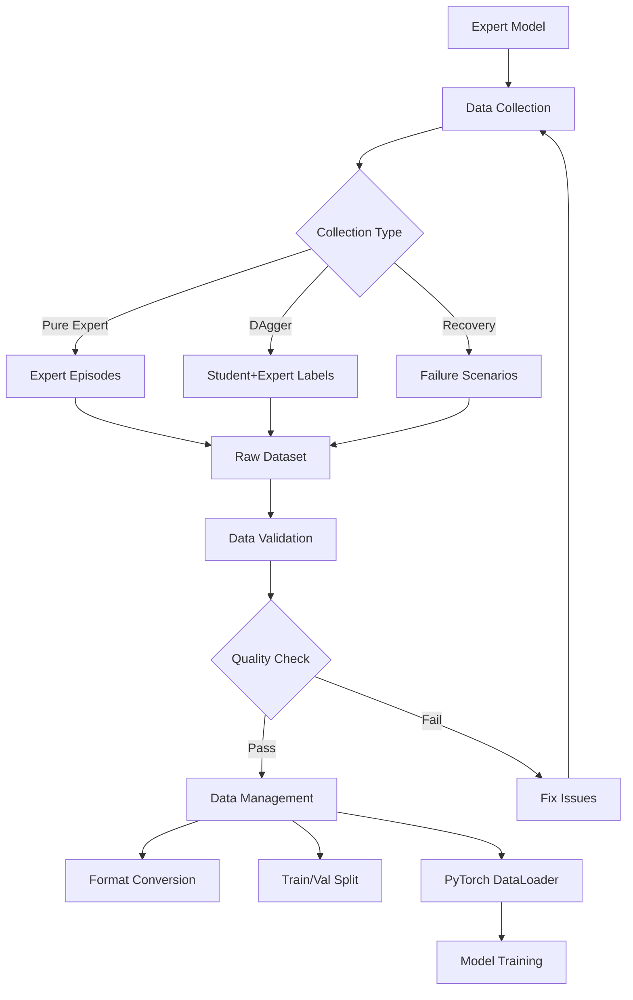

# Expert Data Preparation System

## Overview

This directory contains a comprehensive expert data preparation system for the Deep Reinforcement Learning project (10703). The system enables systematic collection, validation, and management of expert demonstrations for imitation learning in the CarRacing-v2 environment.

## 📁 Files Overview

### Core Modules
- **`expert_data_collector.py`** - Advanced data collection system with support for pure expert demos, DAgger, and recovery scenarios
- **`data_validation_tools.py`** - Comprehensive validation and quality control tools with visualization capabilities
- **`data_utils.py`** - Data persistence, loading, and management utilities supporting multiple formats

### Documentation & Examples
- **`expert_data_preparation_guide.md`** - Comprehensive markdown guide (18 sections)
- **`generate_pdf_guide.py`** - Script to generate professional PDF documentation
- **`usage_examples.py`** - Complete working examples demonstrating all system capabilities
- **`EXPERT_DATA_README.md`** - This file

## 🚀 Quick Start

### 1. Prerequisites
```bash
# Activate your environment
conda activate drl-diffdist

# Verify dependencies
python -c "import gymnasium, torch, cv2, numpy; print('Dependencies OK')"

# Ensure you have the expert model
ls -la ppo_discrete_carracing.pt
```

### 2. Basic Expert Data Collection
```bash
# Collect 50 expert episodes
python expert_data_collector.py --mode collect --episodes 50 --output expert_data_v1

# Validate the collected data
python data_validation_tools.py --input expert_data_v1.pkl --output validation_results
```

### 3. Run Complete Examples
```bash
# See full workflow demonstrations
python usage_examples.py
```

## 📊 Key Features

### Data Collection Strategies
- **Pure Expert Demonstrations**: Optimal trajectories for behavioral cloning baseline
- **DAgger Collection**: Addresses distribution shift with student-expert collaboration
- **Recovery Scenarios**: Focused collection on failure states and recovery behaviors
- **Batch Processing**: Efficient collection with progress tracking and statistics

### Quality Control & Validation
- **Data Integrity Checks**: Shape consistency, range validation, NaN/inf detection
- **Expert Performance Analysis**: Episode returns, success rates, action distributions
- **Anomaly Detection**: Statistical outlier identification with configurable thresholds
- **Comprehensive Visualization**: Automated plot generation for all validation metrics

### Data Management
- **Multiple Formats**: Pickle, HDF5, NPZ, JSON with compression support
- **Dataset Operations**: Split, merge, convert between formats
- **PyTorch Integration**: Direct DataLoader creation for training pipelines
- **Metadata Tracking**: Collection method, timestamps, statistics preservation

## 🔧 Command Line Interface

### Data Collection
```bash
# Basic expert collection
python expert_data_collector.py --mode collect --episodes 100 --output expert_demos

# Recovery scenario collection
python expert_data_collector.py --mode recovery --episodes 20 --output recovery_data

# With video recording
python expert_data_collector.py --mode collect --episodes 10 --save_videos --output demo_with_video
```

### Data Validation
```bash
# Full validation with visualizations
python data_validation_tools.py --input expert_demos.pkl --output validation_report

# Compare two datasets
python data_validation_tools.py --input dataset1.pkl --compare dataset2.pkl --output comparison

# Custom anomaly threshold
python data_validation_tools.py --input data.pkl --anomaly_threshold 1.5 --output results
```

### Data Management
```bash
# Get dataset information
python data_utils.py --command info --input expert_data.pkl

# Convert format
python data_utils.py --command convert --input data.pkl --output data.h5 --format hdf5 --compress

# Split train/validation
python data_utils.py --command split --input data.pkl --output split_data --train_ratio 0.8

# List all datasets
python data_utils.py --command list --input data_directory/
```

## 📈 Data Pipeline Workflow



## 📋 Data Quality Metrics

### Expert Performance Targets
- **Average Return**: > 700 points
- **Success Rate**: > 70% episode completion
- **Episode Length**: 200-1000 steps (environment dependent)
- **Action Smoothness**: Low variance in consecutive actions

### Data Integrity Requirements
- **Shape Consistency**: All observations (4, 84, 84), actions (3,)
- **Range Validation**: Actions within bounds [-1,1] for steering, [0,1] for gas/brake
- **No Missing Data**: Zero NaN or infinite values
- **Temporal Consistency**: Proper episode boundaries and transitions

### Collection Volume Recommendations
- **Initial Dataset**: 50-100 pure expert episodes
- **DAgger Iterations**: 20-30 episodes per iteration × 5-10 iterations
- **Recovery Data**: 10-20% of total dataset
- **Total Target**: 1000+ state-action transitions minimum

## 🎯 Usage Patterns

### Research Workflow
1. **Initial Collection**: Gather baseline expert demonstrations
2. **Quality Assessment**: Validate data integrity and expert performance
3. **Iterative Improvement**: Use DAgger to address distribution shift
4. **Recovery Enhancement**: Add failure scenario handling
5. **Final Validation**: Comprehensive quality control before training

### Development Workflow
1. **Rapid Prototyping**: Small datasets for algorithm development
2. **Format Optimization**: Convert to efficient storage formats
3. **Pipeline Integration**: Create DataLoaders for training
4. **Ablation Studies**: Split datasets for systematic evaluation

## 🐛 Common Issues & Solutions

### Expert Performance Issues
**Problem**: Low average return or success rate
**Solution**:
- Retrain expert model with extended training
- Verify environment compatibility
- Check action mapping correctness

### Memory Problems
**Problem**: Out of memory during collection
**Solution**:
- Reduce batch size in collection
- Use streaming storage for large datasets
- Enable compression for storage formats

### Data Corruption
**Problem**: NaN or infinite values in dataset
**Solution**:
- Add preprocessing validation steps
- Check observation normalization
- Verify action clipping implementation

## 📊 Generated Outputs

### Validation Reports
- `validation_report.json` - Comprehensive validation metrics
- `validation_output/` - Generated visualization plots
  - Episode performance trends
  - Action distribution analysis
  - Data integrity summaries
  - Anomaly detection results

### Dataset Files
- `.pkl` files - Primary storage format
- `.h5` files - Compressed HDF5 format
- `.npz` files - NumPy compressed format
- `_train.pkl`, `_val.pkl` - Split datasets

### Visualizations
- Episode return distributions and trends
- Action histograms and time series
- Reward analysis and cumulative plots
- Data integrity and anomaly summaries

## 🔬 Advanced Features

### Metadata Tracking
- Collection timestamps and methods
- Expert model versions and parameters
- Environment configurations
- Performance statistics and benchmarks

### Extensibility
- Plugin architecture for custom collection strategies
- Configurable validation metrics and thresholds
- Support for additional storage formats
- Integration with experiment tracking systems

### Performance Optimization
- Parallel data collection capabilities
- Efficient batch processing
- Memory-mapped file access for large datasets
- GPU acceleration for preprocessing

## 📖 Documentation

### Available Guides
1. **Markdown Guide** (`expert_data_preparation_guide.md`) - Comprehensive technical documentation
2. **PDF Guide** (generated via `generate_pdf_guide.py`) - Professional formatted documentation
3. **Code Examples** (`usage_examples.py`) - Working demonstrations
4. **API Documentation** - Inline docstrings in all modules

### Generating PDF Documentation
```bash
# Install PDF generation dependencies
pip install reportlab markdown beautifulsoup4

# Generate PDF guide
python generate_pdf_guide.py
```

## 🤝 Contributing

When extending the system:

1. **Follow naming conventions**: Use descriptive class and method names
2. **Add comprehensive docstrings**: Document all public methods and classes
3. **Include error handling**: Graceful degradation for common issues
4. **Write validation tests**: Verify data integrity and format compatibility
5. **Update documentation**: Keep guides synchronized with code changes

## 📞 Support

For issues related to:
- **Data Collection**: Check expert model path and environment setup
- **Validation Failures**: Review validation report for specific issues
- **Format Conversion**: Verify input format and dependency installation
- **Performance Issues**: Monitor system resources and optimize batch sizes

## 📜 License

This expert data preparation system is part of the 10703 Deep Reinforcement Learning course project. Use in accordance with course policies and academic integrity guidelines.

---

**Generated**: 2024-11-19
**Version**: 1.0
**Maintainer**: Course Project Team